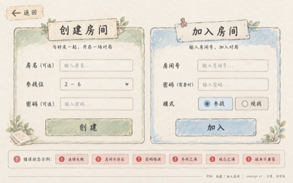
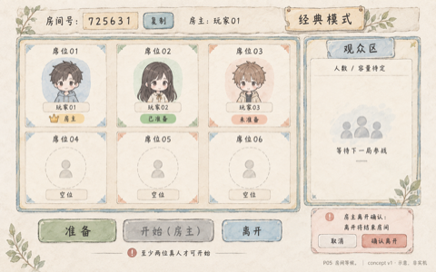
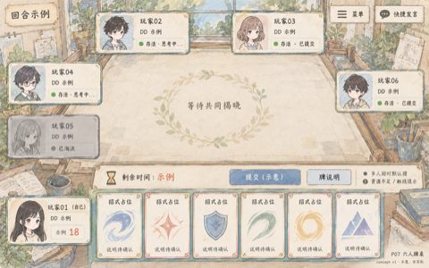
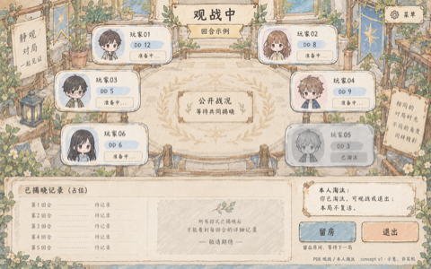

# PAGE-MAP｜准确文字与排布

以 UI-R01 1.0 为输入。本文件只映射现有信息，未批准功能。概念图生成文字与此清单有冲突时不得用于确定玩法。2026-09-12 Teddy 已通过布局验收；已知细节问题见 REPORT。

[六页小尺寸索引](INDEX.svg)；[问题与验收](REPORT.md)；[提示词](prompts.json)。

## P02 主菜单

[排布稿](P02-wireframe-v1.svg) · [概念图 v1](P02-concept-v1.png)

准确文字与区域（1440×900 坐标）：

- (40, 30, 1360, 70)：DeiDei · 当前昵称 / 头像 · 版本示例
- (400, 250, 640, 150)：单人 → P03
- (400, 430, 640, 150)：联机 → P04
- (400, 630, 640, 70)：规则 P11 / 设置 P10 / 退出
- (40, 800, 1360, 60)：断网提示：仅影响联机，单人仍可用

## P04 创建 / 加入房间

[排布稿](P04-wireframe-v1.svg) · [概念图 v1](P04-concept-v1.png)

准确文字与区域（1440×900 坐标）：

- (40, 30, 1360, 70)：DeiDei · 创建 / 加入房间 · 返回 P02
- (80, 140, 610, 540)：创建房间；房名（可选）；参战位：2—6；密码（可选）；创建 → P05
- (750, 140, 610, 540)：加入房间；房间号（不限定示例位数）；密码（需要时显示）；参战 / 观战；加入 → P05
- (80, 720, 1280, 130)：错误状态示例（按情况显示）；连接失败 / 房间不存在 / 密码错误；参战已满 / 观众已满 / 版本不兼容

## P05 房间等候

[排布稿](P05-wireframe-v1.svg) · [概念图 v1](P05-concept-v1.png)

准确文字与区域（1440×900 坐标）：

- (40, 30, 1360, 70)：房间号 / 复制 · 房主：玩家 01 · 经典模式
- (80, 170, 280, 150)：席位 01；玩家 01 · 房主
- (390, 170, 280, 150)：席位 02；玩家 02 · 已准备
- (700, 170, 280, 150)：席位 03；玩家 03 · 未准备
- (80, 360, 280, 150)：席位 04；空位
- (390, 360, 280, 150)：席位 05；空位
- (700, 360, 280, 150)：席位 06；空位
- (1050, 170, 310, 340)：观众区；观众人数 / 容量待定；等待下一局参战
- (80, 590, 1280, 90)：至少两位真人才可开始 · 容量按创建时显示
- (80, 720, 1280, 120)：准备 / 房主开始 / 离开；房主离开确认：离开将结束房间

## P06 双人牌桌

[排布稿](P06-wireframe-v1.svg) · [概念图 v2](P06-concept-v2.png)

准确文字与区域（1440×900 坐标）：

- (40, 30, 1360, 60)：菜单 / 快捷发言 · 回合示例
- (530, 120, 380, 130)：玩家 02 · DD 示例；等待提交 / 托管标记
- (240, 290, 960, 300)：中央公开战况；未揭晓前不展示对方动作
- (40, 610, 1360, 70)：倒计时：示例（时长待定）
- (40, 710, 220, 140)：玩家 01 · 自己；本人 DD 示例
- (290, 710, 800, 140)：本人卡牌：招式占位 / 说明；资源不足状态
- (1120, 710, 280, 140)：提交（示意）；等待对方 / 断线提示

## P07 六人牌桌

[排布稿](P07-wireframe-v1.svg) · [概念图 v1](P07-concept-v1.png)

准确文字与区域（1440×900 坐标）：

- (40, 30, 1360, 60)：菜单 / 快捷发言 · 回合示例
- (350, 110, 340, 120)：玩家 02 · DD 示例；存活 / 已提交
- (750, 110, 340, 120)：玩家 03 · DD 示例；存活 / 思考中
- (40, 280, 230, 130)：玩家 04 · DD 示例；存活 / 思考中
- (40, 440, 230, 130)：玩家 05 · DD 示例；已淘汰
- (1170, 340, 230, 150)：玩家 06 · DD 示例；存活 / 已提交
- (300, 260, 840, 320)：中央公开战况；无选目标步骤 / 隐藏未揭晓动作
- (40, 610, 1360, 70)：倒计时：示例（时长待定）
- (40, 710, 230, 140)：玩家 01 · 自己；本人 DD 示例
- (300, 710, 800, 140)：本人卡牌：招式占位 / 说明；超时默认攒 · 资源不足提示
- (1130, 710, 270, 140)：提交（示意）；本人已提交 / 断线

## P08 观战 / 本人淘汰

[排布稿](P08-wireframe-v1.svg) · [概念图 v1](P08-concept-v1.png)

准确文字与区域（1440×900 坐标）：

- (40, 30, 1360, 60)：观战身份 · 回合示例 · 菜单
- (40, 530, 270, 120)：玩家 01 · 公开 DD 示例；存活 / 提交状态
- (350, 110, 340, 120)：玩家 02 · 公开 DD 示例；存活 / 提交状态
- (750, 110, 340, 120)：玩家 03 · 公开 DD 示例；存活 / 提交状态
- (40, 260, 270, 120)：玩家 04 · 公开 DD 示例；存活 / 提交状态
- (40, 400, 270, 120)：玩家 05 · 公开 DD 示例；已淘汰
- (1130, 320, 270, 140)：玩家 06 · 公开 DD 示例；存活 / 提交状态
- (340, 260, 760, 340)：中央公开战况 / 已揭晓记录；未揭晓动作不可见
- (40, 700, 960, 150)：观战中 · 无个人可出手牌；留房等待下一局（本局不复活）；本人淘汰变体：你已淘汰，可观战或退出
- (1030, 700, 370, 150)：留房 / 退出

## 文案约束

P05 房主离开确认应有“取消 / 确认离开”；密码不公开。P06/P07 回合号与剩余时间分开，计时条紧贴手牌上方；本人可显示“已提交”，其他人未揭晓动作不可见。P08 以“思考中 / 已提交 / 已淘汰”为状态示例，不使用房间“准备中”；下方只有观战说明和已揭晓记录。

招式、消耗、时长、房间号位数、人物和观众容量均未在本包定稿。图上卡牌只表达选招区域，不代表牌库或卡牌数量上限。

## P10 设置（用户追加）

用户要求：“再出一个设置界面吧，我喜欢左右分栏，像 Windows 设置，macOS 设置那样”。本次明确追加授权仅出静态概念图，不改 PRD 或实现页面。

[设置概念图](P10-concept-v1.png)：左侧约 26% 为本机档案与声音／窗口／昵称与头像／关于导航，右侧为选中的声音页：背景音乐、游戏音效、取消、应用；右上关闭。60%／80% 和版本号仅示例。窗口及其他分类内容未展开，不自行定义功能。保存失败和未保存退出提示本图未展示。

工具 image_gen.imagegen，模型 unknown；P04-concept-v1.png 仅作画风参考；提示词见 P10-prompt.txt；无后处理。人工查看确认左右分栏、文字与控件位置；非实机；2026-09-12 用户通过布局验收。
