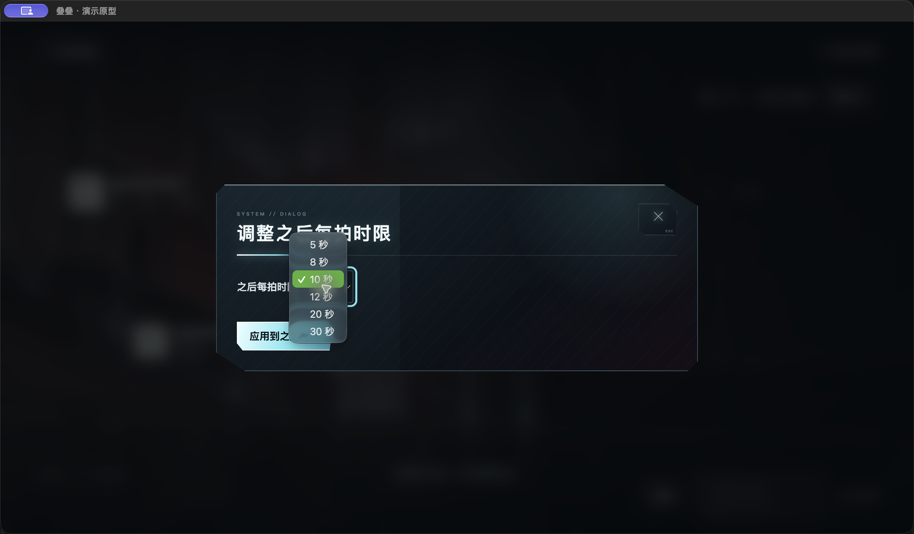
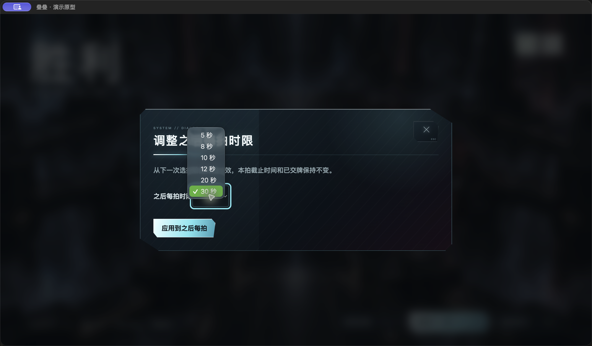
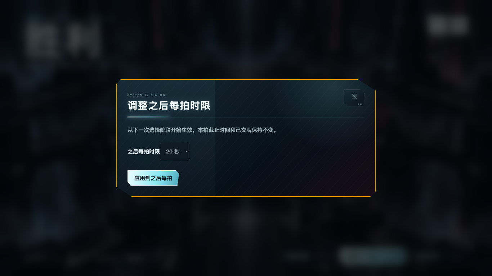
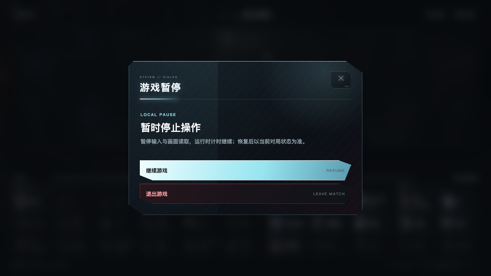
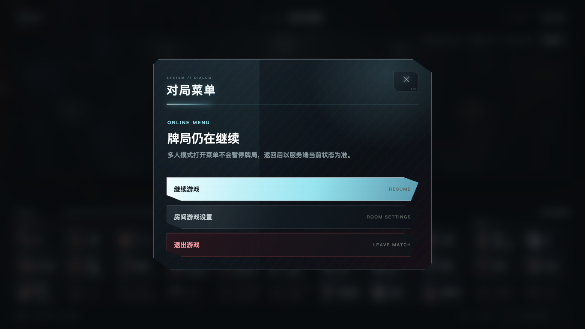
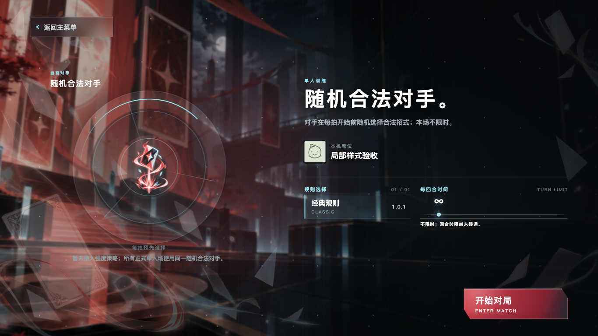
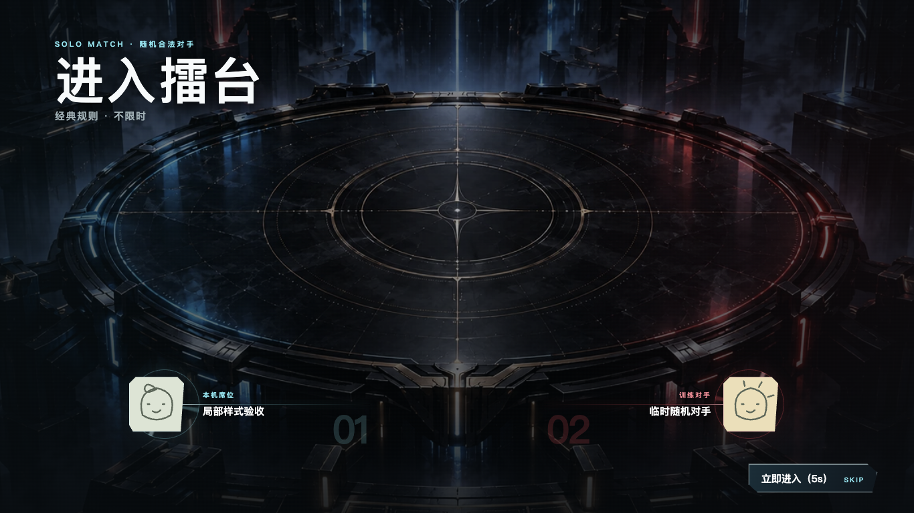

# PR #34 复核书小修交付

2026-10-03。按用户提供的 `DeiDei-PR34-review-2026-10-03.md` 完成 R34-01／02／03；原 A—F 成果、36 个既有提交和失败记录保留。**三组修正及本机定向检查已完成，草稿待用户最终源码确认**。未合并、发布、部署或重做六包；Kimi 未调用（暂停）。

## 版本

- 复核书原 head：`a46b9112840d6b2c604f4c59f04102e67bf3de2a`。
- **本轮修正后源码产品 SHA：`3006f0a42bece4d702c5a7ba48af9d0d0fafbfc8`**。含本报告的最终 head 在 [草稿 PR #34](https://github.com/Kalopsiazza/DeiDei/pull/34) 正文及 `headRefOid` 单列，文件不尝试写入包含自身的 SHA。
- 原 macOS ZIP 仍是 `0a37a89d3ad5e0d1b7817831d3d94f5811e90346`，**没有重建为本轮源码**；仅保留本机，审查者未取得包体。原 31 步成包检查不作为新版安装包验证。
- base 继续为 #33 的 `work/r04-t01-b-frontend-live`／`88185af2c9372b2f1d88707218cafee590b94018`；普通追加提交，保留历史。

|组|实现／检查脚本提交（完整 SHA）|结果|
|---|---|---|
|R34-01 C|`acc0ed3300d7de0996a575355f382ddc6e20ffcc`|主进程取消迟到初始化；不对迟到回复无条件 leave|
|R34-02 D|`feb3451ad6f730c197fad348d88d976889076e24`；`4bdd35df036e622d0cc3cdb53aa6849e7f003160`|共享 Dialog select、语义 hover、实际减少动态消费者及判据；原生操作与 DOM 取样分别记录|
|R34-03 F|`b54dbf77200ad3b50cc48ddf809edb3732f1009b`；`4739d6c8f6e9a19d51ec28370c6dfa92e68d78d5`；`3006f0a42bece4d702c5a7ba48af9d0d0fafbfc8`|失败段、原异常、逐帧数据、真实启动 DPR、有界退出；读回失败尽力回写 FAIL|
|R34-03 E 判据|`68c245333af6cf7d56eb8651710cf3d76f2023b9`；`a07118a52a48daa8d4d9957d009da87a2a9f6362`；`141ba668b4901d40cccbfd97d1c105957e240ad9`|原样 ACK 重发／error=null／单次账目；强杀和等待错误不能作为正常 PASS，保留首个错误|

## 输入变化及检查如何对应

[R34-INPUT-DELTA.json](R34-INPUT-DELTA.json) 保存新的完整路径→SHA256 映射及 14 项本轮源码差异。按原 `build.py` 的 tracked scope，旧 206 项变为 **207 项：新增 1、删除 0、已有项变化 6**。新增 actual-main 回归；变化为 main、三份 CSS、style/performance 两个检查脚本。该范围含测试／README，不能等同于全部编译叶子。另列范围外 integration 的 7 项修改／新增。

图鉴 `docs/results/R04-T01-b/manual-content/content.json` 和 npm lock 均未变。旧 [BUILD-INPUTS.json](BUILD-INPUTS.json) 保留为原包／原 head 的历史证据；不再以“206 项一致”描述新版源码。源码产品至最终文档 head 会再次核对全部 207 项和范围外检查脚本，文档及取样图不参与产品编译。

所有新数值、原始帧时间戳、选值、颜色、输入摘要和关键清理记录在 [CHECKS.json](R34-evidence/CHECKS.json)。大日志、CPU／trace、失败尝试和 ignored 原生控制脚本仍保留本机，需要时取用。

|实际检查|实际输入／结果与证据边界|
|---|---|
|actual main 受控回归|旧 a46 的真实 handler 在同一探针中 3 PASS／3 FAIL、exit1，退出后仍开 1 socket；新 6／6 PASS、旧初始化不建连。包括退出、快进快出／新连接、关闭、port 替换、sender 和 2999／3000ms 离房边界。VM 控制档案读取、时钟与现有 FakeSocket，非 GUI 证明|
|相关 Node 检查|**clean 3006：51／51，exit0**；含上项、会话／网络／配置／preload／v1.1、零目标及 9 项实际清理函数 VM 回归。没有降低断言或新增 skip|
|D/F 自检及语法|style 反例拒绝零面积、缺卡名、缺席位部件、缺控件类别、常驻阴影假焦点；F 部分采样／throw／timeout、正常／强制退出及读回错误回写通过。最后 F 自检在 clean 3006 exit0|
|类型／构建、基础检查|clean 4bdd：`npm --prefix game/desktop run build` exit0；`python3 scripts/check.py` 59 项、既有预期失败 1、exit0。4bdd→3006 仅 F 诊断脚本变化，产品编译及全部 Python 输入相同，沿用这两项，不扩大回归|
|真实 ACK 定向|clean 4bdd：实际 CLI 服务＋故障代理＋两个 NetworkRoomPort，1／1、exit0。同 ID／seq／payload 四项比较均 true，恢复 error=null，公开 human Def 仅结算一次；三个单字段变化反例各自不通过。产品网络源码和这些检查输入至 3006 未变，无 Electron／跨设备结论|
|D targeted Electron|实际起点 4739，**仅 F 诊断脚本 dirty**；driver exit0、pageErrors=[]、layouts=0。本地普通 worker，在线既有 MOCK；4 个暂停按钮七次样式取样（含 disabledPressed），两处 select、三组 motion。全部 9 项 D/main/生成输入与 3006 字节相同。disabled/busy 为 CSS 属性合成；既有 `app.exit(0)` 是测试退出，不计为 F 正常关闭|
|D 真服务原生控件|clean 4bdd：普通 main＋真实 CLI＋一个合成 Peer，driver exit0。大厅 10→30s、战局 30→20s，经原生 CUA 方向键／Return 与真实 policy 确认。九项消费者／生成输入与 3006 一致。系统区域截图由本地 Codex 实际看图；战局 Dialog 在 selecting 打开，原生操作期间服务继续，Apply 时已 result，**本轮不重验当前截止时间**|
|F 真实教程 throw|clean 3006，普通 main／真实 WorkerPort tutorial selecting：**driver exit1（预期）**，原 INJECTED_SEGMENT_THROW、9 帧、active=false，摘要读回重算一致。启动原生 DPR2／1473ms；其后 CDP DPR1，与样本 DPR 分列|
|F 真实教程 timeout|clean 3006：**driver exit1（预期）**，原 TimeoutError 150ms、18 帧、active=false，摘要重算一致；启动原生 DPR2／926ms，样本也是原生 DPR2|

F 两条的 Electron 均普通 close／before-quit **exit0、signal=null、forced=false**；真实 worker 及全部自有后代 PID 已消失，临时档案删除。worker 自身退出码未由接口暴露，不推定它是 0。失败 driver 的 exit1 和应用的正常 exit0 是两个结果。RAF 回调间隔仍不是 GPU 呈现帧时间；首次可操作没有清 OS 缓存，不作为冷磁盘启动指标。

清理 VM 另验证 close 抛错／未标记 SIGKILL／非零退出／wait_error 会使整体 FAIL，首个错误不被覆盖，第一项回收失败仍继续回收其他资源。既有 Q10 主动 SIGKILL 仅记 `EXPECTED_FAULT`、normalExit=false。故障代理只在内存持有私密请求，持久证据只有比较布尔值。

## 实际消费者与截图

共享 select 为 `#e7f6f8`／`#0c1922`、dark color-scheme、3px 青色焦点；disabled 为 `#899ba5`／`#101a22`。原生展开像素独立看图，DOM 对比度不代替系统菜单。当前消费者没有天然 disabled select，禁用图明确为合成样式取样。

本地与在线暂停 primary／danger 保持原颜色、边框和背景语义；默认、hover、active、focus-visible 及禁用指针无动作有计算值与实际可达性检查，selected/busy 完整业务状态没有由属性取样推导。

standard 准备扫描和 intro `article::before` 在 reduce 均 animationName=none、iteration=1；恢复普通偏好回到原无限演出。保留静态身份与准备信息、13 份职责 CSS 顺序、欢迎独立和两份运行样式，没有新增坐标系统。

## 失败保留与后续边界

首轮 Home/End、后续 CDP 原生操作诊断和初次 CUA 等待超时均 exit1 并保留；确认 macOS 平台菜单需要实际原生操作后才取得上述成功样本。自动 style 输出中的 native PENDING／NOT_RUN 由独立真服务原生证据补充，没有伪改为自动通过。一次网络启动命令错误地解引用 venv 入口且使用了错误 unittest 导入方式，实际 exit1；改用原 venv 入口和直接文件命令后通过，未安装依赖。读回自检首次匹配到自身字符串，失败记录与普通修正提交保留。

基础检查不能替代 GUI／分发。原生包 GUI 的一次性 CI OS 账户、安装包取件／包体／系统信任、跨设备真人、Windows／干净机／物理断网、连续拖动／转场 resize／完整全屏／物理跨 DPI、最小尺寸与范围外处理、全页面七态仍按原记录待验。1920 图鉴长帧未定位，旧两人严重停顿及欢迎历史偶发问题未闭合，不因这两条短故障样本宣称改善。

复核书 4.7 的预览 ID 复用和 Modal 关闭期间键盘动作仅登记，未作为本轮修正前置，也未擅自实现。继续在 `.worktrees/r04-t02-e`；六个原分包工作区和 ignored 历史证据保留，未归档。独立 Codex 局部复核在 3006 已确认本轮剩余缺口闭合。
