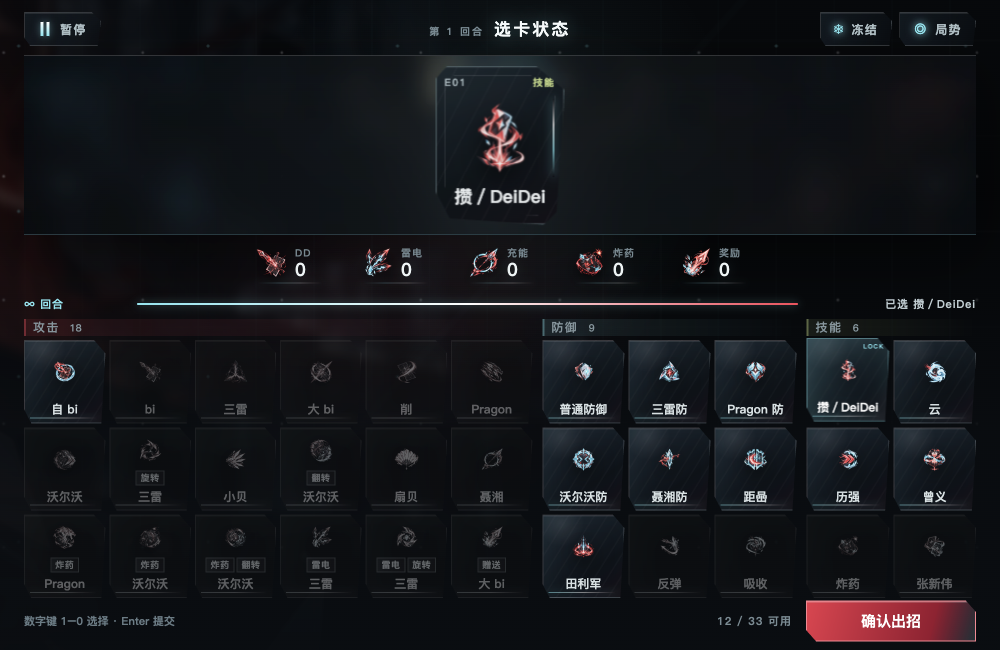
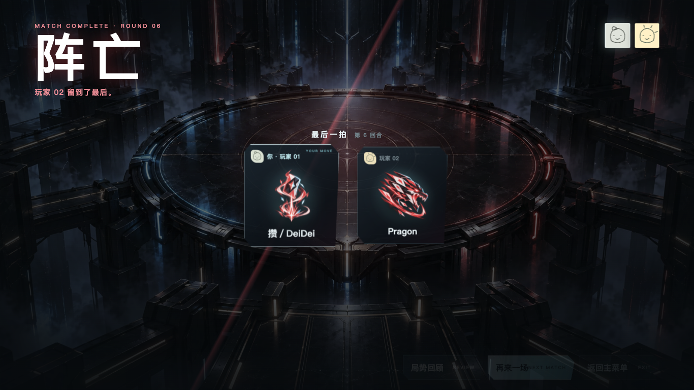

# 可查看运行证据

本目录为运行原件的精选副本，输入／原件SHA256／本机原件路径在 [MANIFEST.json](MANIFEST.json)。整体完成状态仍是里程碑一完成、二／三未完成；单次流程PASS不等于性能或物理过程通过。完整命令／条件见 [REPORT](../REPORT.md)。截图仅含合成档案和测试房间；JSON去掉诊断HTML／凭据字段，旧FAIL保留。

| 文件 | 查看范围 |
|---|---|
| [completion-product.json](completion-product.json) | P1 clean，14项预览／真实trusted键盘／迟延IPC行为，正常退出 |
| [welcome-product.json](welcome-product.json) | P1 clean，37项欢迎／P01／真实watcher热刷新，同PID、资产／动画／媒体状态；明确MOCK socket |
| [archive-before.json](archive-before.json)、[archive-after.json](archive-after.json) | 历史严格native焦点true的固定8wheel对照，raw RAF和实际scroll；不是最终P2复测 |
| [online-baseline.json](online-baseline.json)、[online-ambient-ab.json](online-ambient-ab.json)、[online-backdrop-ab.json](online-backdrop-ab.json) | 固定窗口真实服务复用调查；流程PASS，性能仍未完成／native焦点false；raw phase frames／trace哈希 |
| [online-dynamic-failure.json](online-dynamic-failure.json) | 整体FAIL的六人布局／观战／时限部分证据，保留首错 |
| dynamic文件 | 原始FAIL与最终新目录结果分开，不改写旧记录；详见REPORT及MANIFEST |

P1同进程热刷新后回到菜单：

当前P2真实worker的1000×650选牌停点；对应10路线189记录整体PASS，物理过程验收仍未完成：

P1预览本人阵亡，处于结果交接，底部按钮暂时不可操作是既有入场阶段；ledger／结果验证在14项JSON：

真实服务六人选择阶段，1000×650；按既有规则选择阶段不展示公开揭晓席位；整次run后来FAIL：

历史严格图鉴局部处理后的1920×1080／DPR2截图；其global CSS与P2不同，最终聚焦复测待做：

原生拖窗／完整全屏／跨屏动作没有有效录屏，未拿静态片段代替。大CPU profile／trace保留在本机R目录，MANIFEST给完整哈希；它们不是本目录已上传的附件。
