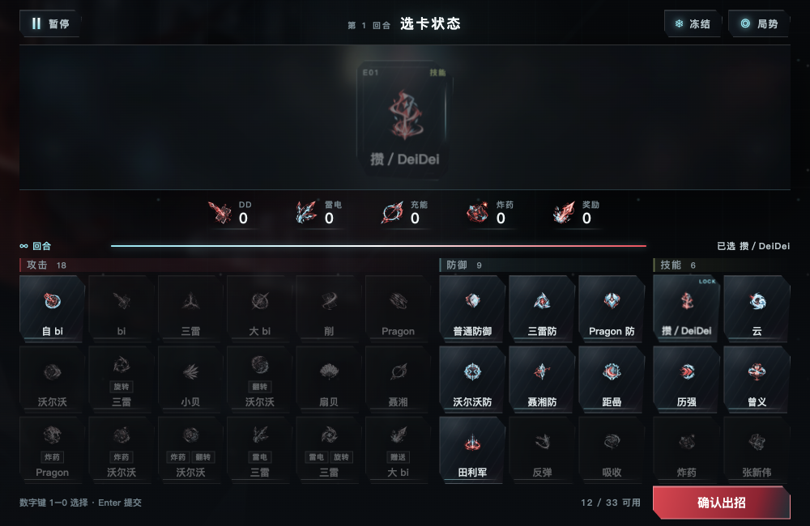
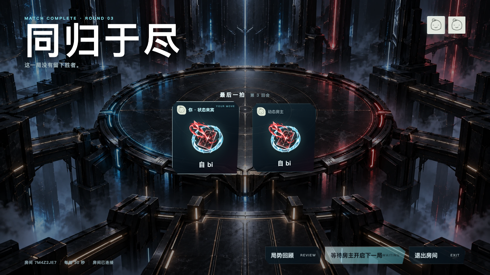
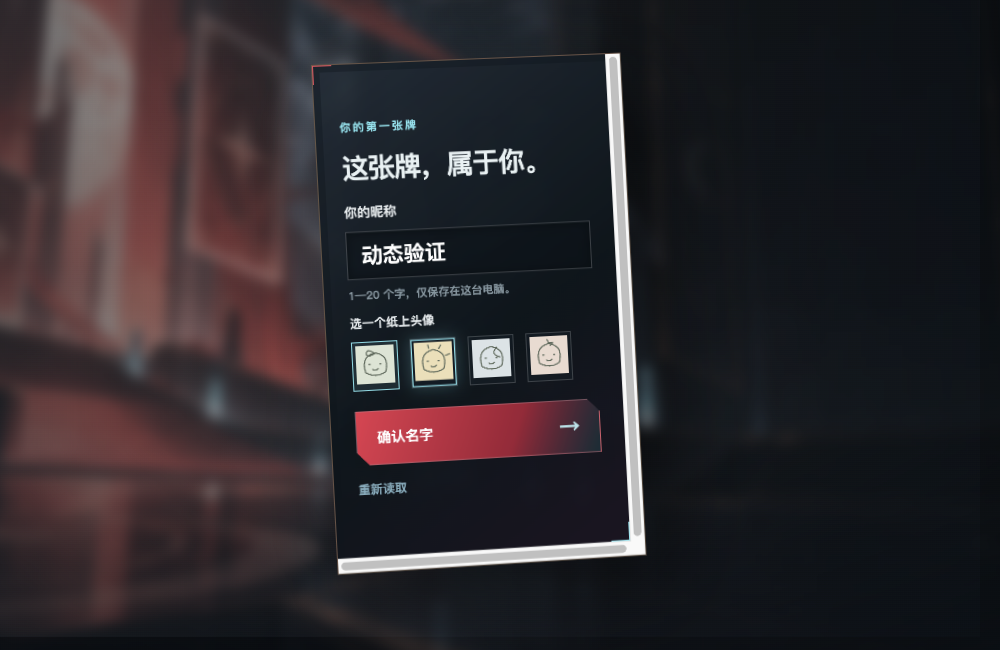

# 可查看运行证据

当前产品 `dc38024a91818c3e2a2ca537675549409cfca620`。三个里程碑的本机执行与增量交付完成，第二轮待增量复核和 Teddy 实际体验／外部安排确认。以下是提交中的可查看副本；[MANIFEST](MANIFEST.json) 给原件／副本 SHA256、准确输入和大文件本机保留边界。JSON 凭据／HTML字段脱敏，截图与房间都是合成本机测试数据；dirty 输入、历史 FAIL 与正常／强制清理不改写。

| 可查看材料 | 实际范围 |
|---|---|
| [最终动态](dynamic-final-p5.json) | clean63496395b59af71998a47a1e183e509c8472865b，普通main/真实worker，10路线／189控件／50聚焦停点，三高风险偏好和短空间；截图不能代替连续 resize 记录 |
| [真实联机动态](online-unlocked.json) | 本机owned CLI／同host6→3→4→5→2＋六人viewer，17PASS；N2/N6完整路线／严格飞行、当前拍30s不变及下一拍20s。P3+dirtyP4，renderer/style/main与P5同指纹 |
| [最终在线控件](controls-online-final.json) | clean6349639，66verified／796natural，11请求busy、结果／WAITING／返厅／双leave；raw controlStatesComplete=false不改，原生接受另证 |
| [原生select接受](native-select-accepted.json)／[初始30](native-select-popup-30.png)／[Up高亮20](native-select-popup-highlight-20.png)／[Return接受20](final-native-select-accepted.png) | 实际CUA，popup关闭、dialog仍开、driver option20000；[母运行整体FAIL](controls-online-v7-failure.json)保留，marker仅恢复收集器，20选值不等于政策已应用 |
| [六批控件及适用性](../CONTROL-STATES.md)／[图鉴附加88](controls-archive-extra-final.json)／[loading7](controls-loading-final.json) | 真实pointer／down／Tab、原业务disabled/busy、合法IPC迟延失败及NA；不同consumer/class/fieldset，正常0；焦点离散采样不冒充等待全程native证明 |
| [最终欢迎调查](welcome-final-p5.json) | clean2c5b0b896a31331d12627b471647a70d9223c8c0，37checks／11segments，fresh/同PID/P01/实际watcherreload，P5输入、正常清理；历史人物异常未复现，返菜单max183.7ms、自然重播131个>50ms及checkpoint69 droppedVideoFrames保留 |
| [最终严格图鉴](archive-final-p5.json)／[历史before](archive-before.json)／[历史after](archive-after.json) | native1920×1080/DPR2，两区8wheel。P5 list17.7/33.6/>50=0，detail17.6/17.7/>50=0；201focus配对/native无blur。负CPUdelta97/77、detail trace discarded16保留，非全产品性能结论 |
| [图鉴偏移原FAIL](dynamic-final-p5-v1-failure.json)／[正常诊断](archive-scroll-diagnose.json)／[最小起步诊断](archive-scroll-diagnose-minimum.json) | 原1248→1314不改写；两诊断和最终full v2稳定baseline后仍1248。原66px原因未确认，无产品scroll reset或容差放宽；临时collector原文也已归档 |
| [原生P5](native-explicit-p5.json)／[P4下限来源FAIL](native-p4-failure.json) | 实际全屏进退、同DPR双屏往返、选择/键盘及正常退出由P5证明；真实1000×650下限来自P4，源整体清理FAIL保留 |
| [15秒全屏/入场片](native-fullscreen-entry.renderer.mp4)／[25.040秒尺寸/跨屏片](native-size-display-selection.renderer.montage.mp4) | P4 renderer-only，前者连续41–56s，后者THREE-CUT；H2641920×1080/25fps/无音轨。原生frame/display和整体FAIL结合上行JSON读，灰边不等于window size |
| [M1预览／关闭14项](completion-product.json)／[SharedUI两props合同](modal-contract.json) | actualApp/原main/真实键盘；SharedUI与P5一致，test parent只改props，无实现副本 |
| [最终clean构建/守卫](checks-final-qa.json)／[P5 Node76/Python59](checks-p5.json)／[原21工作区保护](worktrees-completed-preservation.json) | build产物与P5相同，五guards0；未改核心/服务检查按精确P5输入继承。旧21 HEAD及完整status相同，不当GUI或CI证明 |

当前普通 main／真实 worker，在 1000×650 CSS 内容区选「攒」：

实际本机联机来宾结果：WAITING 主动作禁用、回顾及退出可达：

最终严格1920图鉴复验后的画面（DPR2原件3840×2160，不是物理4K验收）：

实际欢迎最小内容区／P01人物交接：

原件 R=`/Users/zengchongtai/develop/DeiDei/.local-outputs/r04-t03-a/`；大CPU／trace／完整录像仅本机保留并给精确哈希，不以绝对路径冒充远端附件。v7–v12在线 FAIL、图鉴v2强制清理和v3失焦317.4ms partial峰值均保留。[报告](../REPORT.md)说明输入链、性能限界及不同DPR/4K/Windows/干净机/真人/新包等具体条件；未 merge、发布、部署或进入第二轮，Kimi未调用。
