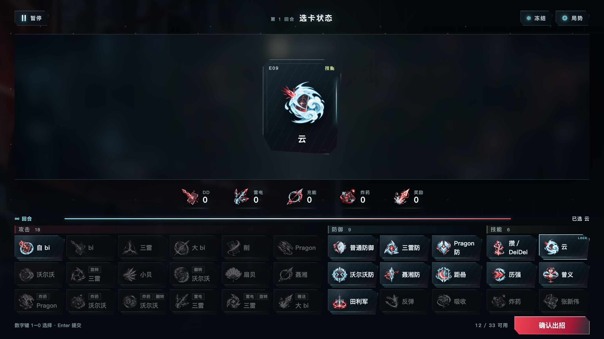
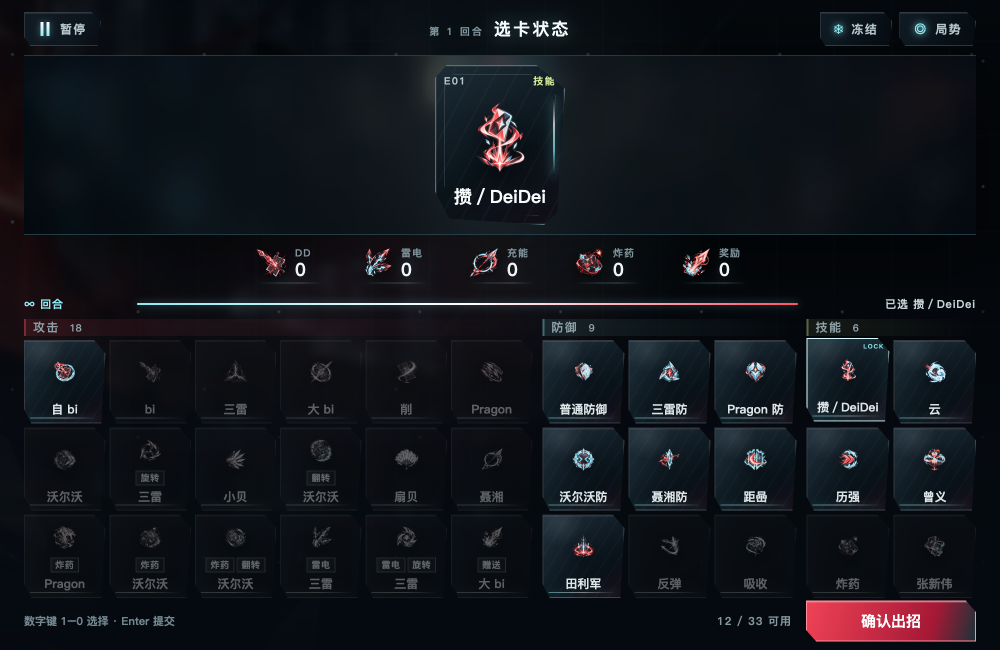
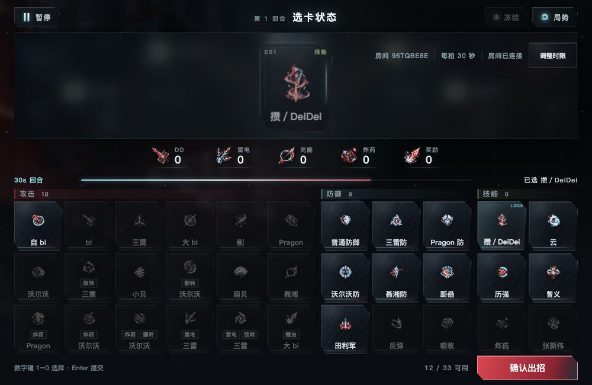
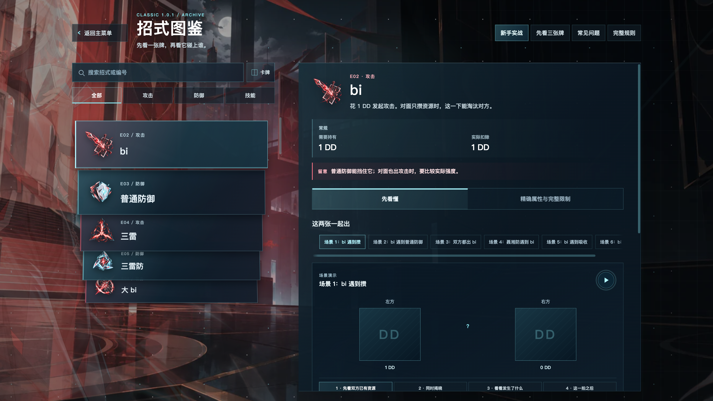

# 可查看运行证据

本目录是精选运行副本，均已回读并核对 [MANIFEST](MANIFEST.json) 中原件／副本 SHA256。当前产品 `dc38024a91818c3e2a2ca537675549409cfca620`；里程碑一完成，二／三未完成。实际输入、dirty collector、来源和失败边界见 [REPORT](../REPORT.md)。截图／录像仅有合成档案和本机测试房间；JSON凭据／HTML字段去除，大trace/CPU保留忽略目录原件及哈希，未冒充远端附件。

| 文件 | 实际范围 |
|---|---|
| [当前产品构建与检查](checks-p5.json) | P5 build、Node76、Python59/既有expected failure1、四guards均exit0；不是GUI接受 |
| [真实联机动态](online-unlocked.json) | 普通main/owned CLI/合成peers，同host6→3→4→5→2＋六人viewer，17PASS；N2/N6完整路线／严格飞行及后拍时限。sourceP3+dirtyP4，renderer/style/main与P5同指纹 |
| [Modal合同](modal-contract.json)／[设置动态](settings-unlocked.json) | actual SharedUI两propscase与实际设置offset0各PASS；明确旧HEAD+待提交产品/QA，未复制组件实现 |
| [欢迎控件](controls-front.json)、[设置控件](controls-settings.json)、[恢复控件](controls-recover.json) | 88/141/55状态记录，原App真实pointer/down/Tab及合法IPC迟延/失败，normalexit0 |
| [本地牌桌控件](controls-local.json)、[图鉴控件](controls-archive.json)、[教程控件](controls-tutorial.json) | 167/141/50记录、真实worker与实际业务锁／只读焦点，normalexit0；有限适用性见 [状态表](../CONTROL-STATES.md) |
| [P5原生进程](native-explicit-p5.json) | 普通main实际全屏进退、同DPR双屏往返及Cloud选择，213聚焦samples；stop录像38.600s后close1.190s正常exit0。三次边缘拖动未达下限，不以此PASS替代P4下限证据 |
| [P4原生过程及整体FAIL](native-p4-failure.json) | 实际CUA拖到1000×650、fullscreen/displayevents；录像尚未完成时app.close超时、main强回收，录像后来完成；安装依赖的停止链在quit之前，旧阻塞hook未直接量到；FAIL保留 |
| [15.000秒全屏/入场片](native-fullscreen-entry.renderer.mp4) | P4连续源41–56s，renderer-only；原生frame/event须对照上述JSON，源整体FAIL不变 |
| [25.040秒尺寸/跨屏三段剪辑](native-size-display-selection.renderer.montage.mp4) | P4源60–64.5/214.5–219/246.5–262.5s，THREE-CUT非连续；renderer-only1920×1080/25fps/H264/无音轨，灰边不等于window尺寸，末帧已选攒不是云 |
| [P2解锁图鉴](archive-unlocked-p2.json)／[历史before](archive-before.json)／[历史after](archive-after.json) | 明确1920×1080/DPR2/两区8wheel的源输入／焦点与帧数据；P5最终严格复验尚未运行，未将旧结果继承为当前PASS |
| [在线v5部分证据/FAIL](controls-online-v5-failure.json)／[v6原生焦点失败](controls-online-v6-failure.json) | v5已采35项和真实retry/create/join/role容量，原生popupUp20后Mac锁屏、未Return；v6checks0/nativefocusgate失败。整体FAIL原样保留，在线后半不计通过 |
| [预览/关闭键盘14项](completion-product.json)／[旧欢迎37项](welcome-product.json) | P1 clean；普通main/真实trusted键盘或同PID watcher/明确MOCK socket。当前共享组件指纹相同，欢迎完整P5复验仍待 |

P5原生全屏、跨屏返回后 Space 选「云」，内容1366×768/DPR2；图像须与原生事件和运行记录一起读：

P4实际拖到1000×650，PNG2000×1300/DPR2；对应原运行整体FAIL，正常退出由P5单独提供：

历史真实六人1000×650选择停点；旧整次动态后来FAIL，当前完整动态来源另见online-unlocked.json：

历史严格图鉴局部处理截图；不替代P5最终聚焦复验：

原始目录为 `/Users/zengchongtai/develop/DeiDei/.local-outputs/r04-t03-a/`。历史JSON、失败首错、非零driver、强制与正常退出区分保持。当前两屏均DPR2；3840×2160截图不是物理4K、renderer录像没有原生边框/鼠标轨迹，不能据此宣布跨DPI或Windows接受。
