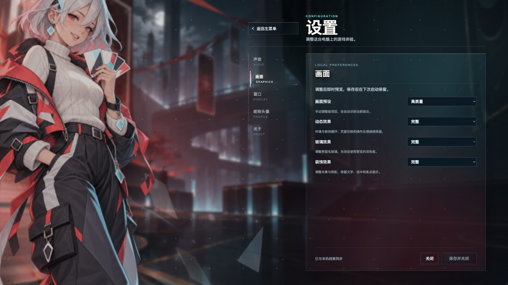
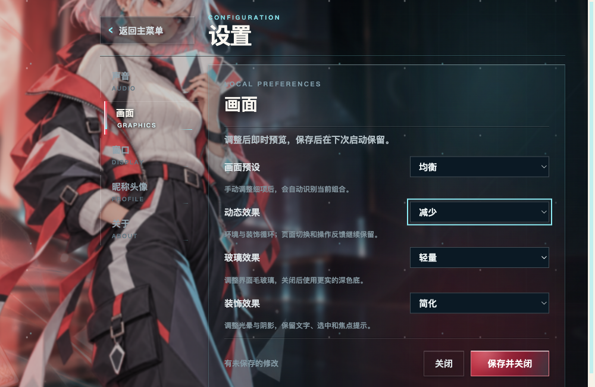
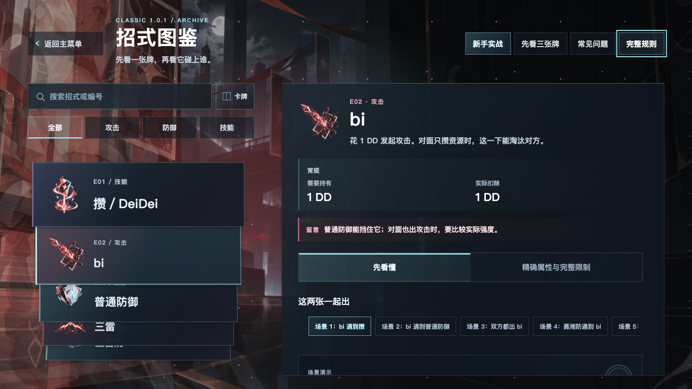

# R04-T04-a 画面设置交付

2026-10-04，[Issue #37](https://github.com/Kalopsiazza/DeiDei/issues/37)。A → B → C 连续完成，等待草稿 PR 审阅。

- 起点／PR base：`codex/frontend-round2-20261004`，`d539c06cc8e4b55371b56429759d3a58dd202337`。
- 执行分支：`codex/video-settings-20261004`；主仓库内工作区 `.worktrees/video-settings` 保留，未归档。
- 实际被测产品：`b6bf4b008fbced775205ab5d5f7b89ca0ef11d69`；A 为 `1671abd810db2d8587bff5030804ef52c9305752`，B 为上述产品提交。最终交付 HEAD 由草稿 PR 正文完整列出；后续 C 仅补设置定点复测模式、本文、入口说明与证据，未改产品。功能与完整对照运行时 dirty 只有 DESIGN／README；定点复测另有脚本与交付文档，产品构建摘要仍完全一致，见 [summary.json](evidence/summary.json)。

## 功能与范围

`graphics.cjs` 统一预设、校验、复制与匹配；profile 沿用严格字段校验、同目录临时写入和 rename。合法旧 v1 首次读取返回内存 v2＋高质量，字节不变；下一次保存迁移 v2 并保留身份、头像及未改设置。新建／确认恢复为 v2＋均衡，无效字段或枚举拒绝落盘。

App 复制整份设置及 graphics 草稿，根画面值从草稿／已保存档案派生；分类切换保留草稿，继续编辑保留预览，放弃恢复已保存效果。写盘前注入保存失败保留输入、预览、错误和旧文件；重试成功使用主进程返回档案，完整重启后保留。保存中编辑、分类、重复保存及离开均阻塞。

| 档位 | 大厅／设置环境 | 氛围／光晕／粒子 | 设置薄玻璃／内容 | 装饰光影 |
| --- | --- | --- | --- | --- |
| 高质量 | 原26s漂移 | 原循环 | 实际24px／18px | 原9px光晕blur与阴影 |
| 均衡 | 保留26s漂移 | 暂停 | 6px／6px，110% | 去附加blur与大装饰阴影 |
| 流畅 | 暂停 | 暂停 | 无有效毛玻璃，深色底 | 简化 |

工作单的12px／14px属于 nonbattle-pages 中间声明；起点 prepare.css 后置覆盖为24px／18px，真实计算样式已确认。高档保留原外观，未为匹配中间声明重写它。三档、三个单项与自定义改回预设都有真实消费者断言；低档共享弹窗6px／backdrop4px或关闭有效滤镜。原弹窗动画会把关闭滤镜计算为 `blur(0px) saturate(1)`，它与 none 等效；测试严格拒绝非零blur或非1饱和度，保留原动画与240ms关闭行为。

系统减少动态、减少透明度分别／同时启用，以及均衡同时启用均验证最终样式；保存值和预设名称不随系统改写。设置、图鉴弹窗关闭恢复焦点；图鉴搜索／清空、卡牌／图标两模式、Bi选择与阅读状态、原生滚轮和拖动通过。四背景循环仍暂停，持续选中扫光低档不可见，单次hover保留且服从系统减少动态；12px拖动区／6px滑块、图标和横向条单mask保留，卡牌四边mask未恢复。

连续 `setContentSize` 验证1366×768 → 1000×650 → 1920×1080 → 1366×768：草稿和焦点保留，无新增横向溢出，保存／关闭可达。这是实际Electron内容区调整，未表述成人工拖窗或物理4K验收。共享输入、滚动条源码未修改；欢迎水平分流、规则、联机消息、权限与依赖未改变。

## 实际检查

| 命令 | 结果 |
| --- | --- |
| `npm --prefix game/desktop run build` | PASS，含strict类型检查 |
| `node --test game/desktop/test.cjs game/desktop/test-graphics.cjs game/desktop/test-navigation.cjs` | PASS，21项；新增6项先失败再实现 |
| `node --test --test-name-pattern="R04 release stage derives" game/desktop/test-packaging.cjs` | PASS，含graphics运行模块缺失路径检查 |
| `node game/desktop/smoke-graphics.cjs` | PASS，functional-4，122个定点记录，renderer error 0 |
| `node game/desktop/smoke-graphics.cjs --measure` | PASS，measure-1，15段短对照，renderer error 0 |
| `node game/desktop/smoke-graphics.cjs --measure --settings-only` | PASS，仅3段设置复测，renderer error 0 |
| `node .local-outputs/R04-T04-a/media-fallback/probe.cjs`（主仓库） | PASS，独立普通main注入本地媒体加载失败，回标题后正常进入大厅，档案字节不变 |
| `node --check game/desktop/smoke-graphics.cjs`／`--self-check`／`git diff --check` | PASS |

三个smoke命令均带 `DEIDEI_PYTHON=/Library/Frameworks/Python.framework/Versions/3.13/bin/python3` 和独立 `DEIDEI_GRAPHICS_OUTPUT`；媒体probe不进入worker。完整原始JSON、rAF时间戳、资源样本与失败截图保留在主仓库ignored `.local-outputs/R04-T04-a/`：functional-1至4、measure-1、measure-settings-repeat-1、media-fallback及probe。所有记录正常退出，无强制结束；临时合成档案已移除，最终证据回读校验。原二轮目录仍为d539c06、Git干净；GUI只使用自建进程和合成档案，不操作用户档案或原窗口。

前三次功能FAIL保留：1）错误地把高档内容期待为14px，实测18px后按完整cascade修正；2）进程重启后测试复用旧Page定位，重新建立定位；3）把动画填充的零滤镜误判为未关闭，0／100／400ms定点确认后改为严格有效滤镜断言。产品未因此改写高档或弹窗动画，没有新增skip或降低行为断言。

NOT_RUN：根Python完整检查、全房间／TLS、跨设备、Windows、原生打包与安装包GUI；本单明确不要求，且规则／网络／模型未改。stage检查只证明新增模块进入分发输入，不代表已有新安装包。

## 同机短对照

普通main，独立v2档案，同一显示器id2、逻辑bounds2304×1536、实际DPR2、刷新率59.9838Hz；内容区实际1920×1080。未模拟DPR或刷新率；原生减少动态／透明度均false。所有段native与document焦点、可见性保持，无失焦混入。rAF间隔是回调间隔，不是实际呈现FPS，也不用于推定GPU根因。

三档各大厅稳定观察30秒；设置在入场完成并稳定1400ms后取1200ms样本。图鉴同一Bi／“先看懂”档案，列表和详情每段从scrollTop0开始，各4次+500、4次−500 native wheel，间隔180ms。三档列表均0→2000→0，详情均0→807.5→0；实际八次输入与焦点见summary。

| 片段 | p95 ms | max ms | >50ms次数 |
| --- | ---: | ---: | ---: |
| fresh-process-natural-welcome | 18.60 | 85.00 | 2 |
| same-process-natural-replay | 18.60 | 18.70 | 0 |
| p01-return | 18.60 | 50.00 | 0 |
| hall-high-30s | 18.60 | 18.80 | 0 |
| settings-high-stable | 34.60 | 35.30 | 0 |
| archive-high-list | 18.50 | 18.70 | 0 |
| archive-high-detail | 18.50 | 18.70 | 0 |
| hall-balanced-30s | 18.60 | 18.80 | 0 |
| settings-balanced-stable | 33.10 | 35.20 | 0 |
| archive-balanced-list | 18.60 | 33.30 | 0 |
| archive-balanced-detail | 18.30 | 18.70 | 0 |
| hall-smooth-30s | 18.30 | 18.70 | 0 |
| settings-smooth-stable | 18.10 | 18.40 | 0 |
| archive-smooth-list | 18.40 | 33.30 | 0 |
| archive-smooth-detail | 18.40 | 18.70 | 0 |

大厅与图鉴此次差异小。流畅档设置的短样本间隔较低，因此只重复对应设置片段，所有复测结果保留：

| 设置复测 | p95 ms | max ms | >50ms次数 |
| --- | ---: | ---: | ---: |
| settings-high-stable | 34.70 | 50.10 | 1 |
| settings-balanced-stable | 33.50 | 34.00 | 0 |
| settings-smooth-stable | 17.90 | 18.60 | 0 |

两轮设置样本呈现相近差异；1200ms短样本不证明长期稳定性能，也不足以归因。高档复测50.1ms记录保留，不取最好一次覆盖它。

新进程开场与同PID自然重播均播放到6.584s、1920×1080、ended／paused为true、媒体error为null；P01返回成功且档案保持。新进程有85ms最大rAF间隔、2次超过50ms；同进程重播本次没有超过50ms，不宣称历史长帧已修复。

另以普通main和独立均衡v2档案，将开场video改为不存在的本地素材并load；实际MediaError code4触发回标题，进入按钮可见／可用，随后进入大厅。档案回读与原字节相同，renderer error 0，PID19209正常exit0且临时目录移除。此定点测试验证加载错误路径，不覆盖所有解码器或设备故障；源码与完整记录在本机media-fallback目录，摘要随本文提交。

## 代表画面与保留事项

图鉴四边渐隐／逐层景深缺项、退场被入场填充覆盖、完整页面进退与欢迎历史同进程长帧继续登记待处理。main保存后setFullScreen的异常事务问题仍按工作单保留；失败注入发生在写盘前。未增加限帧、垂直同步、渲染比例、自动画质或硬件评分。

使用VEW并进行定点自审；Kimi未调用。等待草稿PR审阅，未合并或发布；继续开发在 `.worktrees/video-settings`，保留本任务分支与证据。
