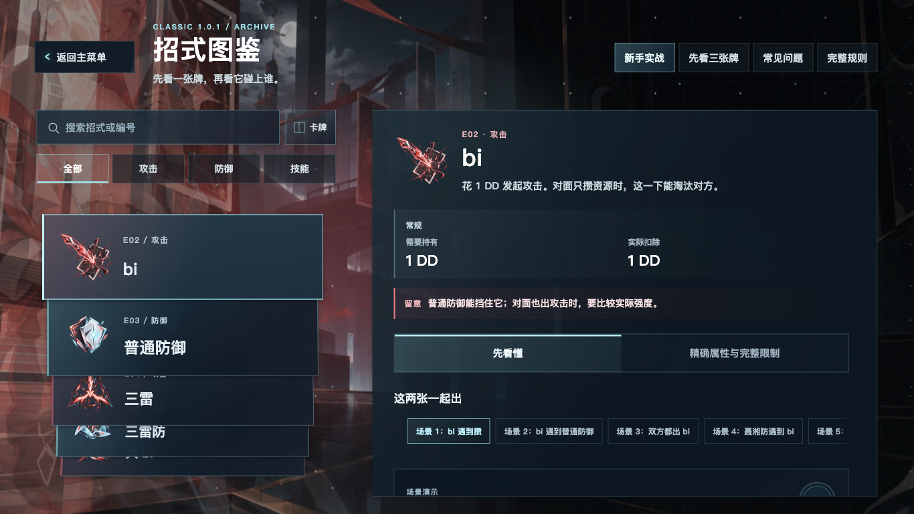
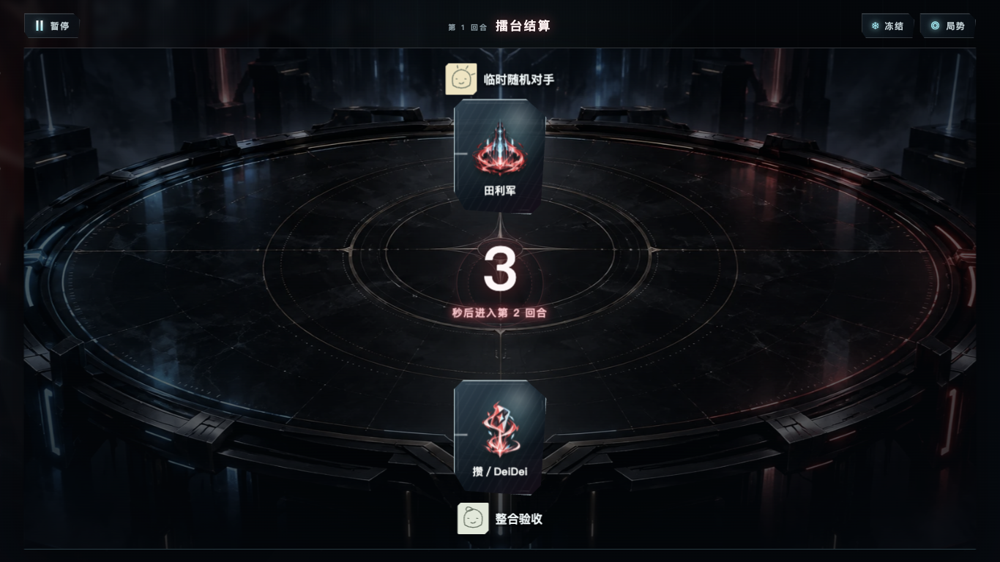
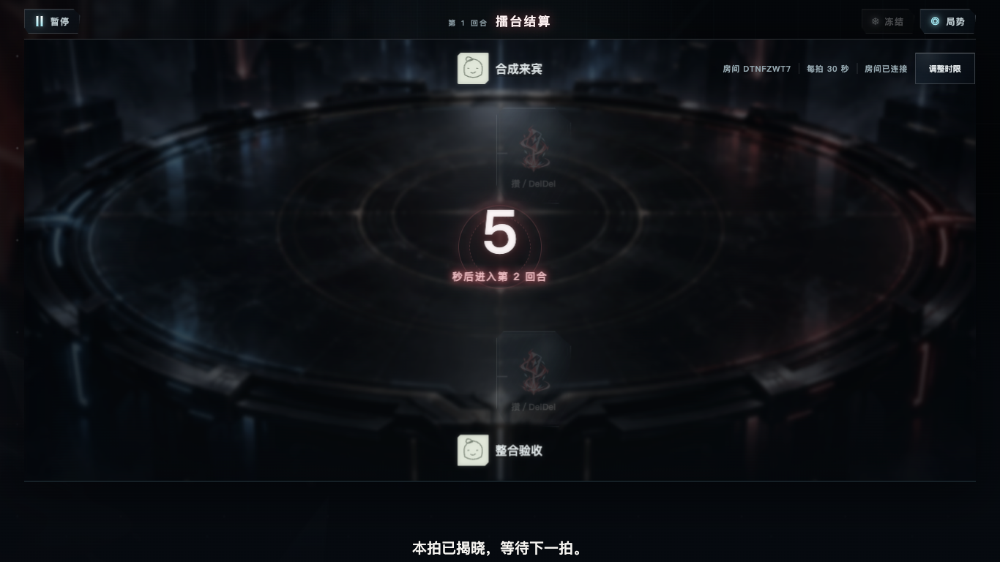

# R04-T05-a｜main 整合候选交付

2026-10-05，Refs #39。[草稿 PR #40](https://github.com/Kalopsiazza/DeiDei/pull/40)。**候选已交付，待最终源码确认**；未合入 main、改仓库设置、关闭旧 PR、删除分支、打包、部署或正式发布。Kimi 未调用，按 VEW 做范围检查与本机自审。

## 固定版本与路径

- main 起点：`889162fc90000919004f498b27cffbd5fa4cbe45`，远端读取与工作单一致。
- 固定候选 #38：`4c8b4656d26fecbe5964a2ac18b51a723f456b14`；不纳入后续前端试改。
- 普通 merge：`bc52630c8bd7a3a68d81c5e8aecbc5b5c9af360f`，无冲突，保留两个父提交与原祖先。
- A：`8175f36283b1d98e24c4f9738c7a78ba9039a709`；B：`39b7f3876c34d8e580dc6653bb3f20ef99c8074d`；C 首个产品／检查输入：`908ba5fa12aee17fa356ed5c792160e72cf3bcaf`。
- 最终被测产品／检查输入：`c610eff67892bc2964230d5f717e0234f16eb0b6`。C 后续仅修测试中的屏幕边界记录、当前 MOCK 定位及无密码 null 协议输入，产品 CSS 未再改。
- 分支：`integration/r04-main-20261005`；工作区：主仓库 `.worktrees/r04-main-integration`，保留未归档。最终文档 head 与两份远端备份回读记录在 PR 正文，避免为写回自身 SHA 再生成提交。

## A → B → C 的变化

A：8 项旧 AI 原字节迁至 `legacy/rl`，Git blob、字节和 SHA-256 分栏记录于 [PRESERVE.json](../../../legacy/rl/PRESERVE.json)。保留顶层模块名、模型相对位置、原署名与旧 #1 断言；不导入 ML 或反序列化模型。移除 4 个旧 Tkinter 产品入口，现版 game 没有旧 AI 导入。临时副本缺模型、修改源字节均被拒绝。

B：根开发说明指向 Electron 与标准库 worker，历史状态标明日期；`scripts/check.py` 保留语法、根 tests 递归发现，分别运行新 core/runtime、独立规则样本和旧 AI 保全。空组与故意失败的临时测试均非零退出。CI 仍叫 `core-tests`，保留固定 action SHA、Python3.11、最小权限与取消旧运行，增加 Node24.12.0、锁安装及包含类型／构建的桌面 test，15 分钟超时；R02 专用打包工作流不变。

C：仅提高 glass=off 图鉴实际返回按钮的选择器优先级，静止 `#101c27`、悬停 `#1f3744`，保留滤镜关闭、键盘焦点、位移和返回操作。真实 Electron 先复现 alpha0.61，再验证 alpha1，切回 high 恢复原 cascade；高档设置实际24px／18px保持。新增短路脚本只进入测试，不进入产品运行路径。

现版 core/runtime/server、模型、依赖 lock、main/preload 权限与 `manual-content/content.json` 相对 #38 没有额外变化。完整清单为 [SCOPE.json](SCOPE.json)：三份递归树（33／878／880文件），main→产品875个变化、#38→产品37个变化，含双向名称状态、rename、模式与 blob；不使用 GitHub compare 的前300文件作全量清单。最终只追加 REPORT／SCOPE／CHECKS及3张PNG，PR正文单列这6个文档／证据增量，两段共同覆盖最后全部文件。

## 实际验证

| 命令／场景 | 结果与对应输入 |
| --- | --- |
| `python3 scripts/check.py` | PASS：根递归35、core174、runtime27、独立样本192、旧规则25；旧#1预期失败1项；C074/C081两项session继续NOT_RUN。执行于908ba5f，相关输入到最终产品无变化。 |
| `npm --prefix game/desktop ci`、`npm --prefix game/desktop test` | PASS：Node92，含类型、构建、graphics/资源/stage/在线测试。执行于908ba5f，构建／Node输入到最终产品一致；本机额外运行固定Electron安装脚本取得二进制，依赖未变。 |
| 专用锁环境 `PYTHONPATH=game/core:game/server <python> -m unittest discover -s game/server/tests -v` | PASS：71项，含自建回环/TLS；Python3.13.7，锁安装websockets17.0.1，无ML依赖；输入同908ba5f。 |
| `node game/desktop/smoke-graphics.cjs`（功能模式） | PASS：128定点记录，0 renderer error；执行于f2ffa31，最终有效driver和构建输入一致。旧档、预览／放弃／保存／重启、系统偏好、连续尺寸、图鉴搜索/滚轮/拖动/弹窗和返回均保留。 |
| `node docs/results/R04-T05-a/smoke-current.cjs` | PASS：最终产品c610eff，12记录；普通main新建档案、熟悉分流、真实worker提交揭晓及退出；无地址提示、dev明确MOCK、自建真实回环创建/Peer加入/准备/开局/提交/揭晓/退出；对手揭晓前无招式。 |
| 远端 CI | [产品run37269163844](https://github.com/Kalopsiazza/DeiDei/actions/runs/37269163844) success，head为c610eff；实际core-tests各步骤成功，日志已读取。最后文档head的实际CI另在PR正文回读记录。 |
| 范围、原目录与清理 | `git diff --check`通过；33条原工作区登记、234个未提交文件的原字节及暂存diff回读一致；原前端窗口保留，所有测试进程正常退出、临时档案删除。 |

[CHECKS.json](CHECKS.json) 记录输入 SHA、driver与构建摘要、命令、实际结果、失败尝试和未测项。完整原始日志／JSON在主仓库 ignored `.local-outputs/R04-T05-a/` 保留。

当前显示器逻辑1710×1112、DPR2；macOS把请求1920×1080内容区收为1920×994。原生1366×768→1000×650→1920×994→1366×768实际调整，1920×1080使用明确标注的CDP内容模拟；不是物理4K、跨DPI或该原生尺寸验收。首轮尺寸失败保留。两次短路失败源于测试旧MOCK短语和空字符串密码；已按当前源码修测试，不改产品或降低行为断言。全部失败记录保留，未新增skip/expectedFailure。

## 旧 PR 处理建议

以下依据为完整head祖先检查、各PR全部当前文件页和最终Git树逐路径/blob比较，详见SCOPE。相同增量文件证明代码保留，不自动证明该PR整体功能与历史验收；当前PR差异为0也不代表从未采用。仅给建议，不关闭或整包再合。

| PR | 分类 | 依据 |
| --- | --- | --- |
| [#3](https://github.com/Kalopsiazza/DeiDei/pull/3) | 尚未查清 | 0 / 1 个当前 PR 增量路径仍同 blob；其余语义未逐项确认 |
| [#4](https://github.com/Kalopsiazza/DeiDei/pull/4) | 部分采用/后续重写 | 18 / 25 个当前 PR 增量路径仍同 blob；其余语义未逐项确认 |
| [#7](https://github.com/Kalopsiazza/DeiDei/pull/7) | 尚未查清 | 0 / 45 个当前 PR 增量路径仍同 blob；其余语义未逐项确认 |
| [#8](https://github.com/Kalopsiazza/DeiDei/pull/8) | 尚未查清 | 0 / 22 个当前 PR 增量路径仍同 blob；其余语义未逐项确认 |
| [#9](https://github.com/Kalopsiazza/DeiDei/pull/9) | 尚未查清 | 0 / 30 个当前 PR 增量路径仍同 blob；其余语义未逐项确认 |
| [#10](https://github.com/Kalopsiazza/DeiDei/pull/10) | 尚未查清 | 0 / 53 个当前 PR 增量路径仍同 blob；其余语义未逐项确认 |
| [#11](https://github.com/Kalopsiazza/DeiDei/pull/11) | 尚未查清 | 0 / 6 个当前 PR 增量路径仍同 blob；其余语义未逐项确认 |
| [#12](https://github.com/Kalopsiazza/DeiDei/pull/12) | 尚未查清 | 0 / 5 个当前 PR 增量路径仍同 blob；其余语义未逐项确认 |
| [#13](https://github.com/Kalopsiazza/DeiDei/pull/13) | 部分采用/后续重写 | 9 / 17 个当前 PR 增量路径仍同 blob；其余语义未逐项确认 |
| [#14](https://github.com/Kalopsiazza/DeiDei/pull/14) | 部分采用/后续重写 | 89 / 104 个当前 PR 增量路径仍同 blob；其余语义未逐项确认 |
| [#15](https://github.com/Kalopsiazza/DeiDei/pull/15) | 尚未查清 | 0 / 1 个当前 PR 增量路径仍同 blob；其余语义未逐项确认 |
| [#16](https://github.com/Kalopsiazza/DeiDei/pull/16) | 已包含 | head 是产品祖先 |
| [#17](https://github.com/Kalopsiazza/DeiDei/pull/17) | 尚未查清 | 0 / 1 个当前 PR 增量路径仍同 blob；其余语义未逐项确认 |
| [#18](https://github.com/Kalopsiazza/DeiDei/pull/18) | 已包含 | head 是产品祖先 |
| [#19](https://github.com/Kalopsiazza/DeiDei/pull/19) | 已包含 | head 是产品祖先 |
| [#20](https://github.com/Kalopsiazza/DeiDei/pull/20) | 尚未查清 | 0 / 0 个当前 PR 增量路径仍同 blob；其余语义未逐项确认 |
| [#21](https://github.com/Kalopsiazza/DeiDei/pull/21) | 尚未查清 | 0 / 0 个当前 PR 增量路径仍同 blob；其余语义未逐项确认 |
| [#22](https://github.com/Kalopsiazza/DeiDei/pull/22) | 部分采用/后续重写 | 4 / 29 个当前 PR 增量路径仍同 blob；其余语义未逐项确认 |
| [#23](https://github.com/Kalopsiazza/DeiDei/pull/23) | 部分采用/后续重写 | 6 / 53 个当前 PR 增量路径仍同 blob；其余语义未逐项确认 |
| [#24](https://github.com/Kalopsiazza/DeiDei/pull/24) | 部分采用/后续重写 | 6 / 123 个当前 PR 增量路径仍同 blob；其余语义未逐项确认 |
| [#25](https://github.com/Kalopsiazza/DeiDei/pull/25) | 部分采用/后续重写 | 10 / 73 个当前 PR 增量路径仍同 blob；其余语义未逐项确认 |
| [#26](https://github.com/Kalopsiazza/DeiDei/pull/26) | 尚未查清 | 0 / 113 个当前 PR 增量路径仍同 blob；其余语义未逐项确认 |
| [#27](https://github.com/Kalopsiazza/DeiDei/pull/27) | 尚未查清 | 0 / 45 个当前 PR 增量路径仍同 blob；其余语义未逐项确认 |
| [#28](https://github.com/Kalopsiazza/DeiDei/pull/28) | 部分采用/后续重写 | 5 / 72 个当前 PR 增量路径仍同 blob；其余语义未逐项确认 |
| [#29](https://github.com/Kalopsiazza/DeiDei/pull/29) | 尚未查清 | 0 / 2 个当前 PR 增量路径仍同 blob；其余语义未逐项确认 |
| [#30](https://github.com/Kalopsiazza/DeiDei/pull/30) | 尚未查清 | 0 / 66 个当前 PR 增量路径仍同 blob；其余语义未逐项确认 |
| [#31](https://github.com/Kalopsiazza/DeiDei/pull/31) | 部分采用/后续重写 | 15 / 68 个当前 PR 增量路径仍同 blob；其余语义未逐项确认 |
| [#33](https://github.com/Kalopsiazza/DeiDei/pull/33) | 已包含 | head 是产品祖先 |
| [#34](https://github.com/Kalopsiazza/DeiDei/pull/34) | 已包含 | head 是产品祖先 |
| [#36](https://github.com/Kalopsiazza/DeiDei/pull/36) | 已包含 | head 是产品祖先 |
| [#38](https://github.com/Kalopsiazza/DeiDei/pull/38) | 已包含 | head 是产品祖先 |

#3管理报告与#30完整增量未逐项证明采用，继续保留待查；#31已有15个增量路径（网络客户端、wire、TLS服务等）同blob，其他内容可能后续重写，不能称整份接受。#33/#34/#36/#38原head均为产品祖先。旧#1仍归旧环境；#6旧GUI退场不能称修复，Issue不自动关闭。

## 合入边界与保留事项

本轮成功回读main保护：`required_linear_history=true`、严格要求`core-tests`、enforce_admins=true。仓库只允许squash，merge/rebase关闭，delete_branch_on_merge=true；rulesets为空不替代这次实际保护读回。推荐最终保留祖先merge，需Teddy确认后再调整最小管理设置；若选squash，先用备份留完整历史，另行安排前端从新main接续。当前不改设置，不静默改变合入方式。

两份非PR源备份为 `archive/main-before-r04-20261005`（main起点）及 `archive/r04-main-candidate-20261005`（最终文档候选）；实际完整SHA与远端读回见PR。既有同名仅同SHA复用，无强推。

NOT_RUN：外部设备／跨DPI／Windows／新安装包与包GUI／ML加载、训练及评测／新的性能调查／900秒长测／完整动态10路线。欢迎历史长帧、图鉴景深/退场与完整页面进出、单人难度/时限未下传、写盘后setFullScreen异常保持已知；不把本轮有限复测当作修复。

