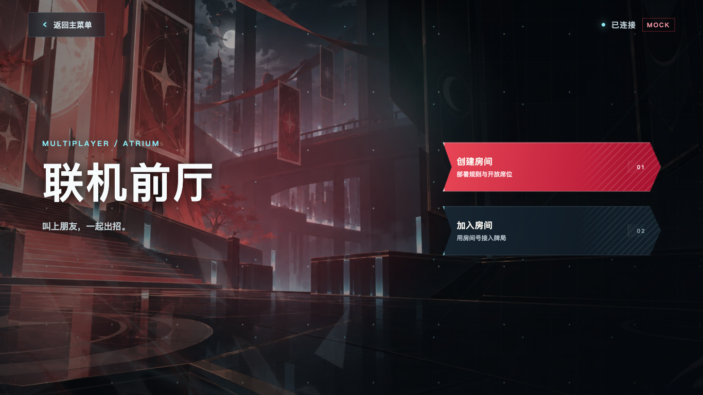
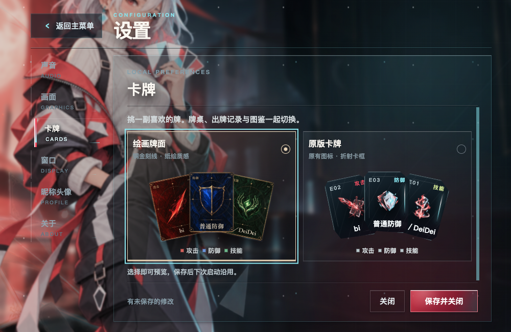
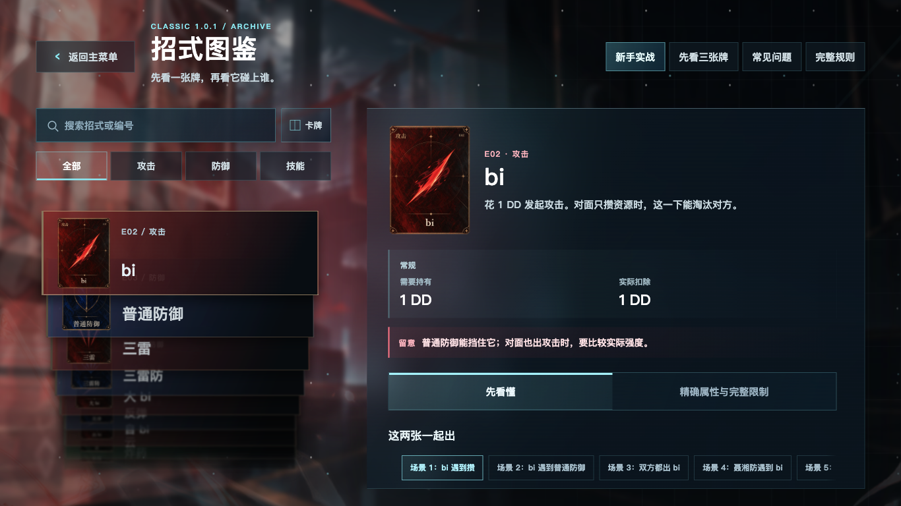

# 两份前端迭代整合与返回按钮统一｜2026-10-06

维护者明确授权统一返回按钮、整合两份本地迭代并合入 main；后续从最新 main 开始前端工作。按仓库现有 PR、core-tests、线性历史及 squash 规则交付，不改管理设置。

## 范围与保留

- main 起点：`91e24616dbef5daf3c575d5aed115c991693ce12`。
- 牌面工作区：`card-art-redraw`，`65d4d3a8af2e0d4ffc81ba525ba110aef7eab5aa`，含三次已提交牌面／风格／揭晓修正及 3 份未提交文件。
- 控件工作区：`video-settings`，`4c8b4656d26fecbe5964a2ac18b51a723f456b14`，合并全部 25 份未提交／新增文件。
- 整合路径：`.worktrees/frontend-main-20261006`，分支 `codex/frontend-main-20261006`。原工作区未改动，仍保留未归档；逐文件恢复副本及 SHA-256 在 `.local-archive/20261006-frontend-main/manifest.json`，读回与原文件一致。

图鉴同时保留新版／原版美术、动态可见范围、80px 叠放与真实退场；设置同时保留卡牌偏好及右侧独立滚动。全部返回入口使用 `SharedUI.BackButton`，统一 48px 高度、15px/700 字体、9px/25px 内边距与玻璃／悬停／系统偏好；宽度随文案长度计算，五字“返回主菜单”为 150px。页面仅保留布局定位，移除旧按钮皮肤覆盖。设置未保存确认、联机前厅返回、房主结束房间等原语义保留。开发监听补入实际 `CardArt.tsx` 及两套牌面资源。

整合保留牌面迭代的档案 v3 与严格 v1/v2 读取；不新增依赖，不改规则、模型、服务协议或 Electron 权限。新 v3 档案不保证旧 v2 程序可读。

## 实际验证

本机独立 Electron 进程与合成档案，原用户档案和已有窗口不受影响。完整日志／截图保留在主仓库忽略目录 `.local-outputs/frontend-main-20261006/`。GUI 不是打包版本；好友场景使用明确标注的 MOCK，真实单人 worker 回合单独检查。

| 检查 | 结果 |
| --- | --- |
| `python3 scripts/check.py` | 261 项，含原有 legacy #1 的 1 项预期失败；独立规则样本及保全检查通过 |
| `npm --prefix game/desktop test` | 类型、构建、94 项 Node 检查通过，无跳过 |
| `smoke-return-glass.cjs` | 122 项通过；三档画质、默认／悬停、所有主要返回入口、两种房间高度、真实模糊像素探针与减少透明度 |
| `smoke-settings-scroll.cjs` | 62 项通过；含关联牌、新手结束、欢迎预览、结算返回及设置滚动／放弃修改 |
| `smoke-ui-controls.cjs` | 31 项通过；时限／单选／键盘／保存协议 |
| `smoke-input-focus.cjs` | 72 项通过；所有共享输入的鼠标／键盘焦点及系统偏好 |
| `smoke-card-style.cjs` | 60 项通过；v2→v3、双风格、保存／重启／放弃／失败重试、原生缩放、真实单人回合与六人 MOCK |
| `smoke-card-art.cjs` | 79 项通过；33 招式、完整牌面、强化／休整、图鉴／结算与真实单人 worker |
| `smoke-archive-effects.cjs` | 78 项通过；三档动效、实际进退、原生滚轮／拖动、高窗口叠放、系统偏好 |

GUI 命令从整合树根目录执行：设置 `DEIDEI_SMOKE_OUTPUT=<证据子目录>` 后运行 `node game/desktop/smoke-<名称>.cjs`；牌面两项脚本用位置参数传入独立证据目录。结算的旧 EXIT 文案定位随共享返回按钮更新，行为断言不变。首次牌面回归发现 CSS 箭头被计入按钮无障碍名称，已给共享组件显式名称并复测通过；失败记录 `card-style/` 保留，最终记录为 `card-style-final/`。图鉴完整高光检查显式使用原版皮肤，绘画牌面的取消高光由其原有风格规则决定。

七组 GUI 共 504 项通过；最终返回／设置复验使用 `return-glass-final/` 与 `settings-scroll-final/`，所有检查无 renderer 错误。实际被测 JS/CSS bundle 与源码重新打包结果逐字节一致。图鉴测试记录实际原生尺寸；超出当前显示器允许尺寸时单独使用 CDP 模拟，未冒充原生缩放。

未追加跨设备／不同 DPI／Windows／安装包验收或 900 秒网络长跑；没有改动对应链路。图鉴最高档不代表完整性能验收。使用 vibe-engineering-workflow，Kimi 未调用。

## 运行截图

好友前厅统一返回（合成档案，MOCK）：

两套牌面与短窗口设置：

新版牌面与图鉴堆叠共存：

